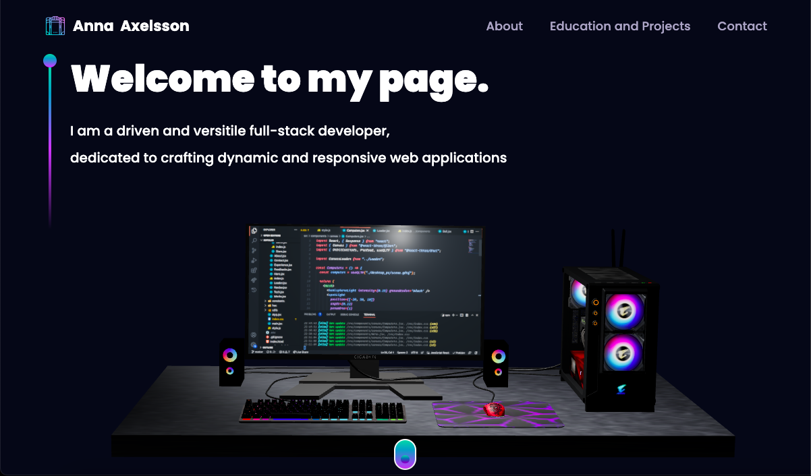
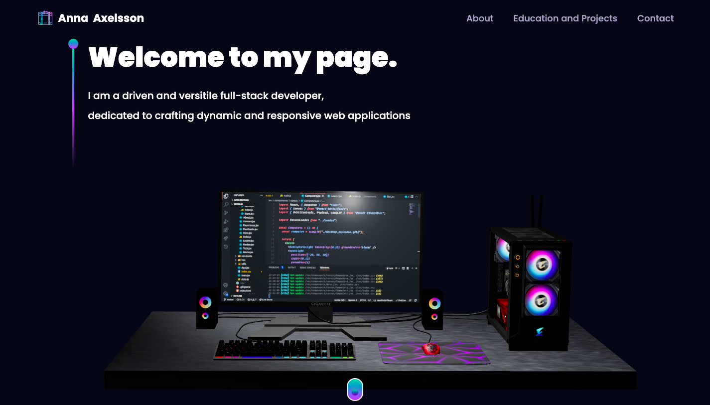

# 3D Portfolio Webpage

[Link to published site](https://annaaxelsson.com/)

## User Interface

---

## Description

This is a 3D Portfolio page built with Vite/React tailwind Css and three.js. It's responsive on mobile and large screens and contains details such as presentation, educational background, technical skills and projects. It also has a contact form through which visotors can send messages. 

---

## Technologies used

- Vite / React
- Three.js
- Tailwind Css
- Node.js
- Responsive
